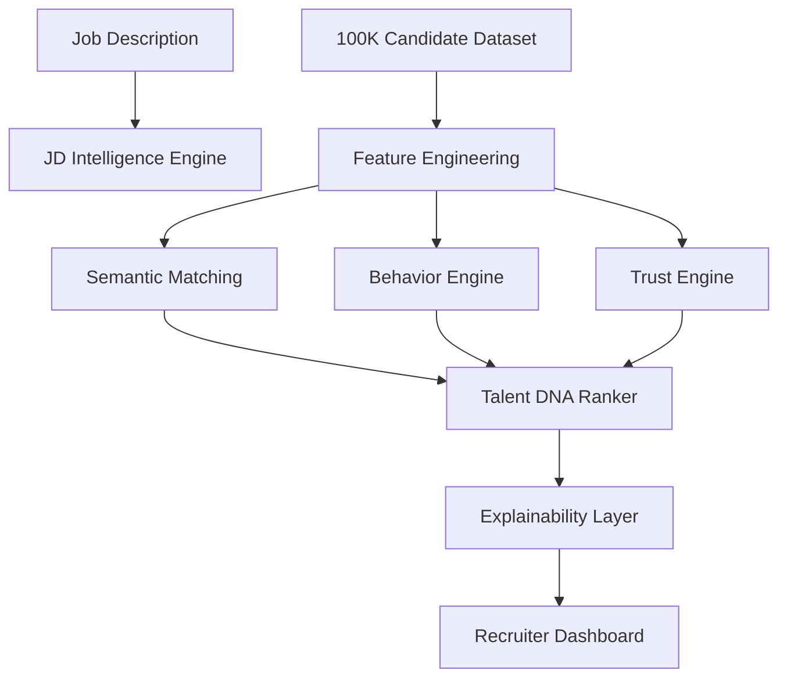

#  TalentMindAI

### AI-Powered Intelligent Candidate Discovery & Ranking Platform

An end-to-end AI Recruitment Intelligence System capable of ranking **100,000+ candidates** using **Semantic AI**, **Behavioral Intelligence**, **Trust Scoring**, and **Explainable AI**.

#  Table of Contents

- Overview
- Features
- System Architecture
- AI Pipeline
- Project Structure
- Installation
- Running the Project
- Dashboard
- Outputs
- Team Contributions
- Future Scope

# Architecture Diagram

# AI Pipeline

Candidates

↓

Feature Engineering

↓

Semantic Matching

↓

Behavior

↓

Trust

↓

Ranking

↓

Dashboard

# Dashboard Preview

## Dashboard

---

## Rankings

---

## Candidate Insights

# Folder Structure

TalentMindAI/

├── app.py
├── ranker.py
├── reason_generator.py
├── integration_test.py
│
├── behavior_engine.py
├── trust_engine.py
├── generate_features.py
├── market_stats.py
│
├── run_matching.py
├── interactive_test.py
│
├── src/
├── data/
├── outputs/
├── notebooks/
│
├── requirements.txt
└── README.md

# Team Contribution

| Module              | Owner    |
| ------------------- | -------- |
| Feature Engineering | Kanishq Joshi |
| JD Intelligence     | Soham Balsaraf |
| Semantic Matching   | Soham Balsaraf |
| Behavior Engine     | Om Karanje |
| Trust Engine        | Om Karanje |
| Ranking Engine      | Sharad Shinde |
| Explainability      | Sharad Shinde |
| Dashboard           | Sharad Shinde |

# Tech Stack

| Category       | Technology            |
| -------------- | --------------------- |
|  Language      | Python                |
|  Data          | Pandas, NumPy         |
|  AI            | Sentence Transformers |
|  Visualization | Plotly                |
|  Frontend      | Streamlit             |
|  Storage       | JSON, CSV, JSONL      |

# Outputs

| File                        | Description               |
| --------------------------- | ------------------------- |
| candidate_features.csv      | Behavior & Trust features |
| semantic_features.json      | Semantic outputs          |
| top_candidates.csv          | Final ranked candidates   |
| parsed_jd.json              | Parsed Job Description    |
| jd_intelligence.json        | JD metadata               |
| candidate_explanations.json | Explainable AI            |

# Future Scope

Roadmap

✅ Semantic Matching

✅ Behavioral Intelligence

✅ Trust Engine

✅ Explainable AI

⬜ Resume PDF Upload

⬜ ATS Integration

⬜ AI Interview Assistant

⬜ Recruiter Copilot

⬜ LLM-powered Resume Parsing

⬜ Candidate Chatbot

⬜ Multi-language Support

---

Built with ❤️ by Team TalentMindAI

Redrob Intelligent Candidate Discovery & Ranking Challenge

⭐ Star this repository if you found it useful!

